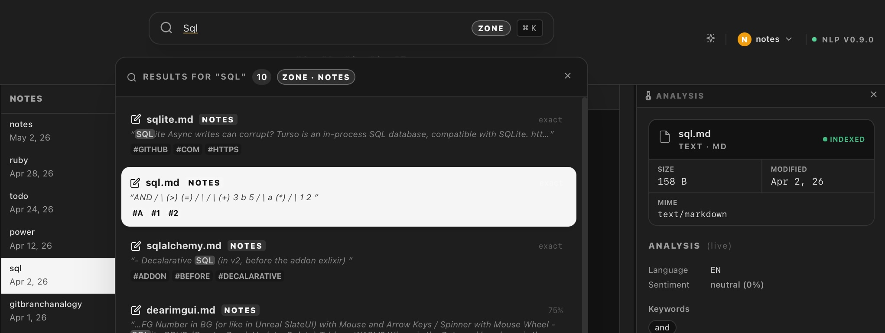

= Syngrafo0

:toc: preamble
:toc-title: Contents
:toclevels: 3
:icons: font
:source-highlighter: highlight.js

// [.lead]
[sidebar]
.about
--
A local-first system for transforming files into structured, searchable, and interactive data.

Document State Machine.
--

image:https://img.shields.io/badge/status-active-brightgreen[]
image:https://img.shields.io/badge/license-MIT-blue[]
image:https://img.shields.io/badge/platform-macOS%20%7C%20Linux%20%7C%20Windows-lightgrey[]
image:https://github.com/pce/syngrafo/actions/workflows/release.yml/badge.svg?branch=main[CI,link=https://github.com/pce/syngrafo/actions/workflows/release.yml]

== Quick Start

[source,bash]
----
python3 scripts/dev.py debug --use-client
----

Optional env vars (defaults shown):

[source,bash]
----
export NLP_DATA_DIR=$(pwd)/data
export NLP_MODEL_DIR=$(pwd)/data/models
----

=== The three paths

[cols="1,2,2", options="header", frame="none", border="none"]
|===
| Path | When to use | How

| *vcpkg*
| Fastest once vcpkg is installed; recommended on Windows.
| Set `VCPKG_ROOT`; `dev.py` injects `CMAKE_PREFIX_PATH` automatically. +
  CMakePreset: `local-vcpkg`

| *FetchContent*
| No package manager at all; self-contained; first build is slow (~10-15 min).
| Sets `SGF_FETCH_AUDIO=ON`, `SGF_FETCH_VIDEO=ON`, `SGF_WITH_LM=ON`. +
  Subsequent builds reuse `_deps_installed/`. +
  CMakePreset: `local-fetch`

| *System*
| Libraries already installed (Homebrew, MacPorts, manual prefix).
| Pass `--deps-mode system`; optionally supply `SGF_CSOUND_ROOT` / `SGF_FFMPEG_ROOT`.
|===

.Local compilation

[source,bash]
----
# vcpkg (fastest once installed):
VCPKG_ROOT=~/vcpkg python scripts/dev.py release \
    --with-audio --with-video --with-lm

# FetchContent (no package manager at all):
python scripts/dev.py release \
    --with-audio --with-video --with-lm --deps-mode fetch

# system (MacPorts, manual install):
python scripts/dev.py release \
    --with-audio --with-video --with-lm --deps-mode system \
    --cmake-extra SGF_CSOUND_ROOT=/opt/local SGF_FFMPEG_ROOT=/opt/local
----

// add `--fresh` to wipe the CMake cache and repopulate build/_deps.

.Prerequisites
[cols="1,1,2",options="header", frame="none", border="none"]
|===
| Tool | Min | Purpose
| CMake | 3.28 | Build system
| Clang / AppleClang | C++23 (Clang 18+ / AppleClang 16+) | Compiler
| Bun | 1.0 | Frontend bundler
| Python 3 | 3.9 | Dev runner, model scripts
|===

== Concept

Syngrafo treats every file as an asset that can be transformed and viewed in multiple ways.

[cols="1,1,1", frame="none", grid="none"]
|===
| *Asset*
| *Transform*
| *View*

| Image · Audio · Text
| OCR · NLP · SVG · Mesh
| Viewer · Kanban · Notes
|===

// A lifecycle-based document state machine.

// Local-first file browser integrating document management, NLP, notes, task boards, and 3D preview.
// File browser + NLP + media + knowledge system
// The Scope looks at first sight broad, that is  intentionally  to avoid early constraints on the UI/UX and data model:
// That’s simply or simplified: “Asset → Transform → View”

== Architecture

[cols="1,2", frame="none"]
|===
| *C++ Core*
| DMS engine · OCR · NLP · SQLCipher · saucer

| *IPC*
| `window.saucer.exposed.*` JSON bridge

| *Frontend*
| React · TypeScript · Tailwind · Three.js
|===

== Features

[cols="1,1", frame="none", grid="none"]
|===
| *File Browser* +
Multi-select · keyboard nav · zones

| *Document Viewer* +
OCR · SVG · media · 3D

| *NLP* +
NER · sentiment · embeddings

| *Zones* +
Encrypted workspaces

| *Notes & Kanban* +
Local markdown + boards

| *3D Preview* +
PLY · OBJ · GLTF · STL
|===

== Search Index

.Index Search in the zone

//           hybrid + chunked + language-aware retrieval
// FTS5 BM25 first, LIKE fallback

[.text-right]
Syngrafo0 uses a semantic search v0.1 index to find related contents

== Image Options

[cols="1,1", frame="none", grid="none"]
|===
| image:data/inp/syngrafo_image_ocr.jpg[width=100%]
| image:data/inp/syngrafo_img_2_svg.jpg[width=100%]

| *OCR Extraction*
| *SVG Reconstruction (Palette: AB)*
|===

== 3D Preview

Three.js renders PLY, OBJ (+MTL auto-detection), GLTF, GLB, and STL files in the Document Viewer through the saucer `local://` scheme.

image::data/inp/syngrafo_3d_2026-05-02at2.27PM.jpg[3d preview]

Controls: *drag* = rotate · *scroll* = zoom · *right-drag* = pan.

== Zones

A Zone pairs a **source folder** (original documents) with a **workspace folder** (index and processed files).

Default workspace path: `{source}/.syngrafo/{zone-slug}/`

Zones support **AES-256 encryption** via SQLCipher. Passphrase → PBKDF2 key → macOS Keychain. Locked zones expose no index data; full search/NLP resumes on unlock.

== Database

`pce::db::Database` (`app/db/database.hh`) — header-only LINQ-style builder.

// No ORM, no macros. Statements compiled once per SQL shape and cached.
// WAL journal mode on every connection.

[source,cpp]
----
auto db = pce::db::Database::open("syngrafo.db");                       // plain
auto db = pce::db::Database::open_encrypted("syngrafo.db", passphrase); // AES-256

auto rows = db.from("dms_zones")
              .where("is_encrypted = ?", 1)
              .order_by("last_visited", false)
              .limit(10).execute();
----

// While the Migration offers StaticFileSources they are intentionally compile-time in Code

== NLP Models

ONNX Runtime is enabled by default on **Linux and Windows** only.
On **macOS**, OCR uses Apple Vision (native, zero extra deps) and `NLP_WITH_ONNX` defaults to `OFF` —
no 230 MB ORT download, no dylib bundling.
Pass `-DNLP_WITH_ONNX=ON` explicitly to enable ONNX-based embeddings on macOS.

.Download (Linux / Windows)
[source,bash]
----
python3 scripts/download_models.py download --models embed,vocab,ocr
python3 scripts/download_models.py check
----

[cols="2,3,1,3",options="header", frame="none"]
|===
| File | Model | Size | Purpose
| `embed.onnx` | all-MiniLM-L6-v2 (int8) | 23 MB | 384-dim sentence embeddings (Linux/Windows)
| `sentiment.onnx` | distilbert-sst-2 | 67 MB | Positive / negative
| `ner.onnx` | bert-base-NER | 415 MB | CoNLL-2003 entities
| `toxicity.onnx` | toxic-bert | 415 MB | Multi-label toxicity
| `vocab.txt` | BERT WordPiece | 232 KB | Shared tokeniser
|===

.Embeddings on macOS (planned)
When `NLP_WITH_ONNX=OFF`, embeddings on macOS can be served by a cross-platform LM runner
(via `SGF_WITH_LM` / llama.cpp) using a GGUF embedding model instead of ONNX.
This keeps macOS fully self-contained and avoids any dependency on ORT.

== OCR backend

[cols="1,2,2", options="header", frame="none"]
|===
| Platform | Backend | CMake flag

| *macOS*
| Apple Vision — native framework, no extra deps, hardware-accelerated on Apple Silicon.
| `NLP_APPLE_VISION=ON` (default)

| *Linux*
| PP-OCRv4 via ONNX Runtime. Tesseract used if installed; ONNX auto-activates as fallback.
| `NLP_WITH_ONNX=ON` (default)

| *Windows*
| PP-OCRv4 via ONNX Runtime. No Tesseract in CI; ONNX is the primary OCR path.
| `NLP_WITH_ONNX=ON` (default)
|===

== License

MIT — see `LICENSE`.
