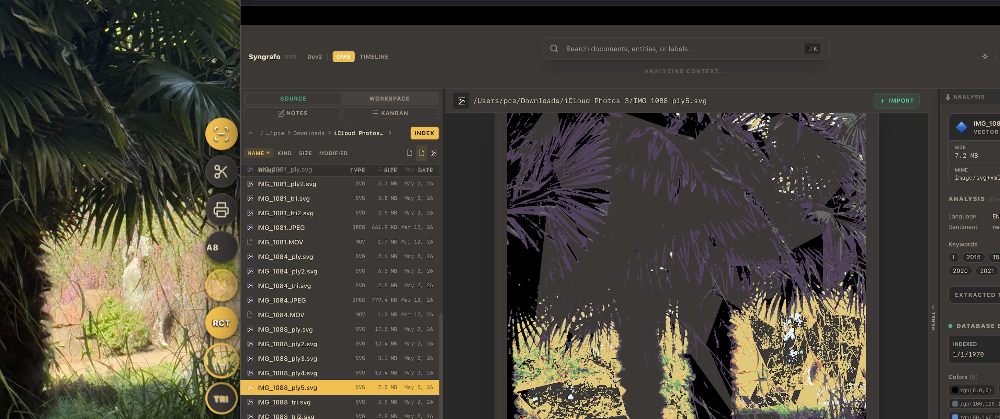
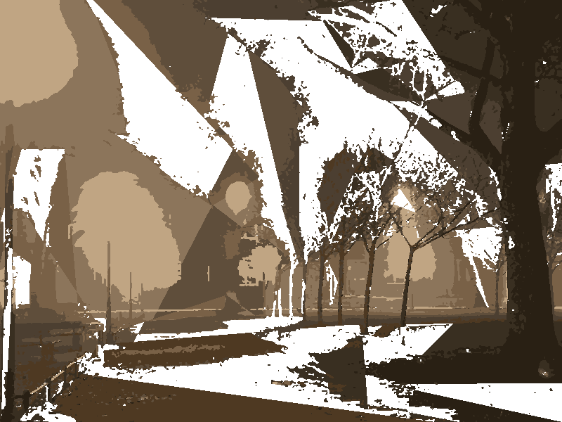
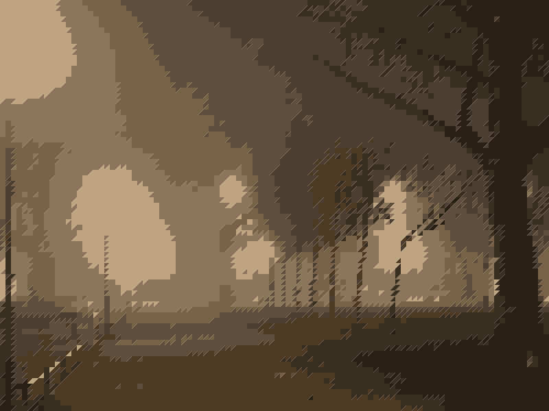
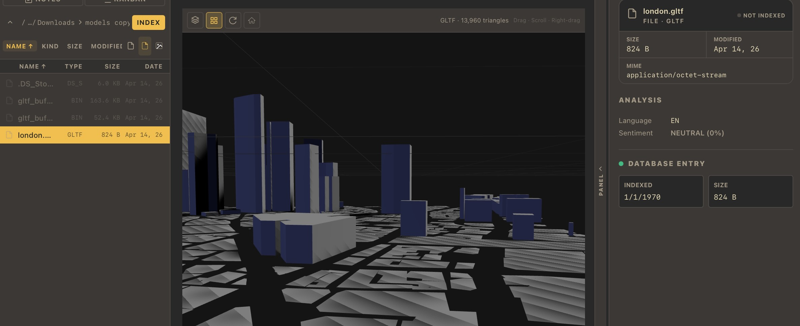

= Syngrafo

[.lead]
A local-first system for transforming files into structured, searchable, and interactive data.

:toc: left
:toc-title: Contents
:toclevels: 2
:icons: font
:source-highlighter: highlight.js

image:https://img.shields.io/badge/status-active-brightgreen[]
image:https://img.shields.io/badge/license-MIT-blue[]
image:https://img.shields.io/badge/platform-macOS%20%7C%20Linux%20%7C%20Windows-lightgrey[]
image:https://github.com/pce/syngrafo/actions/workflows/release.yml/badge.svg?branch=main[CI,link=https://github.com/pce/syngrafo/actions/workflows/release.yml]

Local-first file browser integrating document management, NLP, notes, task boards, and 3D preview — native C++ core, React frontend.

File browser + NLP + media + knowledge system
The Scope looks at first sight broad, that is  intentionally  to avoid early constraints on the UI/UX and data model:

That’s simply or simplified:

  “Asset → Transform → View”

== Quick Start

[source,bash]
----
python3 scripts/dev.py debug --use-client
----

Optional env vars (defaults shown):

[source,bash]
----
export NLP_DATA_DIR=$(pwd)/data
export NLP_MODEL_DIR=$(pwd)/data/models
----

Granular:

[source,bash]
----
# frontend
cd frontend/packages/react-client && bun install && bun run build.ts --minify

# C++ debug build (rebuilds frontend automatically with --use-client)
python3 scripts/dev.py debug --use-client -j8

# run
./build/syngrafo.app/Contents/MacOS/syngrafo
----
== Architecture

[cols="1,3",options="header"]
|===
| Layer | Role
| *C++ Core* | DMS engine, OCR, NLP pipeline, SQLite/SQLCipher, saucer webview host
| *IPC* | `window.saucer.exposed.<name>()` — every binding returns `Promise<string>` (JSON envelope `{ok, data?, error?}`)
| *Frontend* | React 19 + TypeScript, Bun bundler, Tailwind CSS, LinguiJS i18n, Three.js 3D viewer
|===

Key source layout:

[source]
----
app/
  main.cc                 — startup, saucer expose() bindings
  dms_bindings.hh         — binding implementations
  db/database.hh          — LINQ-style SQLite/SQLCipher (C++23, header-only)
  ocr_mac.mm              — macOS Vision OCR
frontend/packages/react-client/src/
  store/                  — dms, theme, settings, locale context stores
  services/dms-service.ts — typed IPC wrappers + file-kind taxonomy
  components/dms/         — FileBrowser · DocumentViewer · AnalysisPanel · ZonePanel
  components/dms/ThreeDViewer.tsx  — Three.js PLY/OBJ/GLTF/GLB/STL viewer
----

== Features

[cols="1,3"]
|===
| *File browser* | Multi-select, keyboard nav, breadcrumb, zone source/workspace toggle
| *Document viewer* | Image (OCR · rectify · PDF export · SVG conversion), PDF, audio, video, SVG inline, 3D models, text/code
| *3D preview* | PLY · OBJ (+MTL) · GLTF · GLB · STL — orbit controls (Three.js)
| *OCR* | macOS Vision framework; Tesseract as Fallback
| *NLP* | Keywords · NER · sentiment · embeddings — all local ONNX, no cloud
| *Zones* | Named workspaces with optional AES-256 encryption (SQLCipher + macOS Keychain)
| *Notes* | Markdown-lite `.notes` folder each zone
| *Kanban* | `.kanban` board each zone with drag-and-drop lanes and cards
| *Search* | Semantic (cosine) + keyword fallback
| *Themes* | 12 colour presets + custom CSS vars, radius/density toggles
| *i18n* | English · Deutsch · Ελληνικά — switch in *Settings → Language*
|===

== Image Options

[cols="1,1", frame="none", grid="none"]
|===
| image:data/inp/syngrafo_image_ocr.jpg[width=100%]
| 
|===

=== OCR

image::data/inp/syngrafo_image_ocr.jpg[Static,300]

=== SVG

.SVG conversion using the “AB” color palette

Image-to-SVG conversion with selectable strategies:

* RCT — pixel-perfect reconstruction
* PLY — polygonal approximation
* TRI — triangulated mesh

Supports configurable color palettes.

The ColorPalette reduces the image to a constrained color set
optimized for vector reconstruction and stylization.

[cols="^1,^1,^1",options="header",frame="none",grid="none"]
|===
| ORIG | PLY | TRI

| 
| 
| 

| Original
| Polygonal
| Triangulated
|===

// image::data/inp/trees.jpg[Static,300]
// image::data/inp/trees_ply.svg[Static,300]
// image::data/inp/trees_tri.svg[Static,300]

== Zones

A Zone pairs a **source folder** (original documents) with a **workspace folder** (index and processed files).

Default workspace path: `{source}/.papiere/{zone-slug}/`

Zones support **AES-256 encryption** via SQLCipher. Passphrase → PBKDF2 key → macOS Keychain. Locked zones expose no index data; full search/NLP resumes on unlock.

== NLP Models

[source,bash]
----
python3 scripts/download_models.py download
python3 scripts/download_models.py check
----

[cols="2,3,1,3",options="header"]
|===
| File | Model | Size | Purpose
| `embed.onnx` | all-MiniLM-L6-v2 (int8) | 23 MB | 384-dim sentence embeddings
| `sentiment.onnx` | distilbert-sst-2 | 67 MB | Positive / negative
| `ner.onnx` | bert-base-NER | 415 MB | CoNLL-2003 entities
| `toxicity.onnx` | toxic-bert | 415 MB | Multi-label toxicity
| `vocab.txt` | BERT WordPiece | 232 KB | Shared tokeniser
|===

== Database

`pce::db::Database` (`app/db/database.hh`) — header-only LINQ-style builder. No ORM, no macros. Statements compiled once per SQL shape and cached. WAL journal mode on every connection.

[source,cpp]
----
auto db = pce::db::Database::open("syngrafo.db");           // plain
auto db = pce::db::Database::open_encrypted("syngrafo.db", passphrase); // AES-256

auto rows = db.from("dms_zones")
              .where("is_encrypted = ?", 1)
              .order_by("last_visited", false)
              .limit(10).execute();
----

== i18n / Language

Switch language in-app: **Theme & Settings → Settings tab → Language**.

To add a locale:

[source,bash]
----
bun run i18n:extract          # scan src/ → update .po files
# translate src/locales/<lang>/messages.po in POEdit
bun run i18n:compile          # .po → .ts catalogs
# register the new code in src/i18n/index.ts → LOCALES
bun run build.ts
----

Catalogs are statically imported so Bun can tree-shake unused ones at build time.

== 3D Preview

Three.js renders PLY, OBJ (+MTL auto-detection), GLTF, GLB, and STL files in the Document Viewer through the saucer `local://` scheme.

Controls: *drag* = rotate · *scroll* = zoom · *right-drag* = pan.

== Build

.Prerequisites
[cols="1,1,2",options="header"]
|===
| Tool | Min | Purpose
| CMake | 3.25 | Build system
| Clang / AppleClang | C++23 (Clang 18+ / AppleClang 16+) | Compiler
| Bun | 1.0 | Frontend bundler
| Python 3 | 3.9 | Dev runner, model scripts
|===

[source,bash]
----
# debug build
python3 scripts/dev.py debug --use-client -j8

# force CMake to rescan dist/
cmake -S . -B build && cmake --build build --config Debug

# tests
python3 scripts/dev.py test --target syngrafo
----

== License

MIT — see `LICENSE`.
