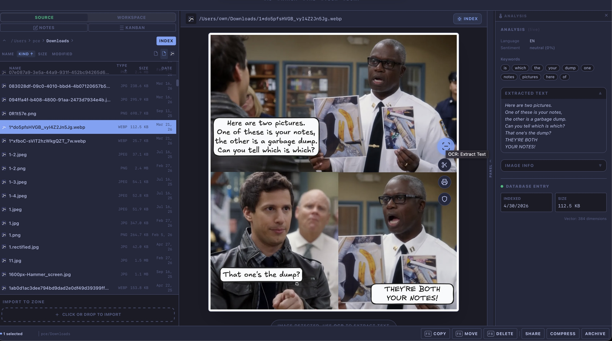

= Syngrafo0.1.0
:toc:
:icons: font
:source-highlighter: highlight.js

Syngrafo0 is a cross-platform, local-first file browser that integrates document management, note-taking, and task organization into a unified system.

It is built around a native C++ core for performance, with a modular frontend architecture.

== Project Status

[cols="1,3"]
|===
| Status        | Active development
| License       | MIT (see `LICENSE`)
| Platforms     | macOS, Linux (Windows planned)
| Architecture  | Native backend (C++) + web-based client
|===

== Features

* Unified file browser with structured navigation
* Document Management System (DMS)
* OCR support for images
* Audio file handling
* Local-first architecture
* Extensible NLP integration
* Integrated notes and lightweight knowledge capture
* Kanban-style task organization

== Screenshots

== Zones & Security

Syngrafo0 uses *Zones* as the primary unit of isolation, organization, and security.

A Zone represents a self-contained workspace that encapsulates files, metadata, indexes, and configuration. Zones are designed to be portable, local-first, and optionally encrypted.

=== Zone Model

Each Zone contains:

* File data (documents, media, attachments)
* Structured metadata (notes, tasks, contacts)
* Search indexes and NLP artifacts
* Configuration and view definitions

Zones can be treated as independent environments and may be created, copied, archived, or deleted without affecting other Zones.

=== Encryption

Zones can be configured to use encryption at rest.

When enabled:

* A *per-Zone encryption key* is used
* Metadata and indexes are encrypted on disk
* Optional file-level encryption can be applied to stored content
* All sensitive data remains local to the device

Encryption is designed to be:

* *Local-first* — no external services required
* *Self-contained* — no global key dependency
* *Portable* — encrypted Zones can be moved between systems

=== Locking and Unlocking

Encrypted Zones operate in two states:

* *Locked*
  - Data remains encrypted
  - No indexing or semantic search is available
  - Minimal metadata exposure

* *Unlocked*
  - Data is decrypted in memory
  - Full functionality is available (search, NLP, views)

Unlocking a Zone provides access only for the current session.

=== Search and NLP Considerations

Syngrafo0 integrates a local NLP pipeline for semantic search and data extraction.

For encrypted Zones:

* Indexes are stored encrypted at rest
* NLP processing occurs only when a Zone is unlocked
* No data is sent to external services

This model ensures that advanced queries (e.g. semantic or contextual search) do not compromise data confidentiality.

=== Design Principles

* *Isolation* — Zones do not share data unless explicitly exported
* *Explicit access* — encrypted data requires user action to unlock
* *No silent sync* — no background transmission of user data
* *Graceful degradation* — functionality reduces predictably when locked

=== Future Work

* Fine-grained encryption (per-file / per-record)
* Secure key management integration (OS keychains, hardware tokens)
* Incremental re-indexing for large encrypted Zones
* Optional encrypted backups and synchronization

== Getting Started

=== Prerequisites

* Python 3
* CMake
* A C++ toolchain (Clang or GCC)
* https://bun.sh[Bun] (for frontend builds)

=== Build (Debug)

From the repository root:

[source,bash]
----
python3 scripts/dev.py debug \
  --build-dir build \
  --source-dir . \
  --target syngrafo \
  -j 8
----

=== Build with Client

[source,bash]
----
python3 scripts/dev.py debug --use-client -j8
----

=== Run

macOS app bundle:

[source,bash]
----
./build/syngrafo.app/Contents/MacOS/syngrafo
----

Binary in build directory:

[source,bash]
----
./build/syngrafo
----

== Environment Configuration

[source,bash]
----
export NLP_DATA_DIR=$(pwd)/data
export NLP_MODEL_DIR=$(pwd)/data/models
----

== Frontend

[source,bash]
----
cd frontend/packages/react-client
bun install
bun run build.ts --minify
----

== Architecture

=== Overview

Syngrafo is structured into three main layers:

[cols="1,3"]
|===
| Layer        | Description
| Core (C++)   | Document management, indexing, processing
| Services     | API layer exposing DMS functionality
| UI           | Web-based client
|===

=== Core (C++)

The DMS logic is implemented in the `syngrafo` target.

Backend components:

* `dms_bindings.hh`
* Progress events emitted via:
  `window.__dms_progress`

=== Services

* DMS API abstraction layer

=== UI

* Configurable frontend (default: React-based client)

== Concepts

=== Zones

Zones are isolated workspaces used to organize data and workflows.

They can represent:

* Projects
* Sandboxes
* Logical environments

== File Browser Capabilities

* Image processing (OCR)
* Audio file support
* Extensible for additional media types

== Development

=== Run Tests

[source,bash]
----
python3 scripts/dev.py test --target syngrafo
----

=== Troubleshooting

Force CMake to rescan the `dist/` directory:

[source,bash]
----
cmake -S . -B build
cmake --build build --config Debug
----

== Roadmap

* [ ] Complete DMS core implementation
* [ ] Stable client bindings
* [ ] Zone-based workflow system
* [ ] Cross-platform packaging
* [ ] Plugin system
* [ ] Search and indexing improvements

== Contributing

Contributions are welcome.

To get started:

1. Fork the repository
2. Create a feature branch
3. Make focused changes with clear commits
4. Open a pull request with a description of the changes

Please ensure:

* Code builds successfully
* Tests pass
* Changes are documented where applicable

== Design Goals

* Local-first and offline-capable
* Predictable performance via native core
* Clear separation of concerns
* Minimal external dependencies
* Extensibility without fragmentation

== License

This project is licensed under the MIT License. See the `LICENSE` file for details.

== Acknowledgements

Syngrafo builds on established ideas from file systems, document management systems, and knowledge tools, while focusing on a unified approach.
